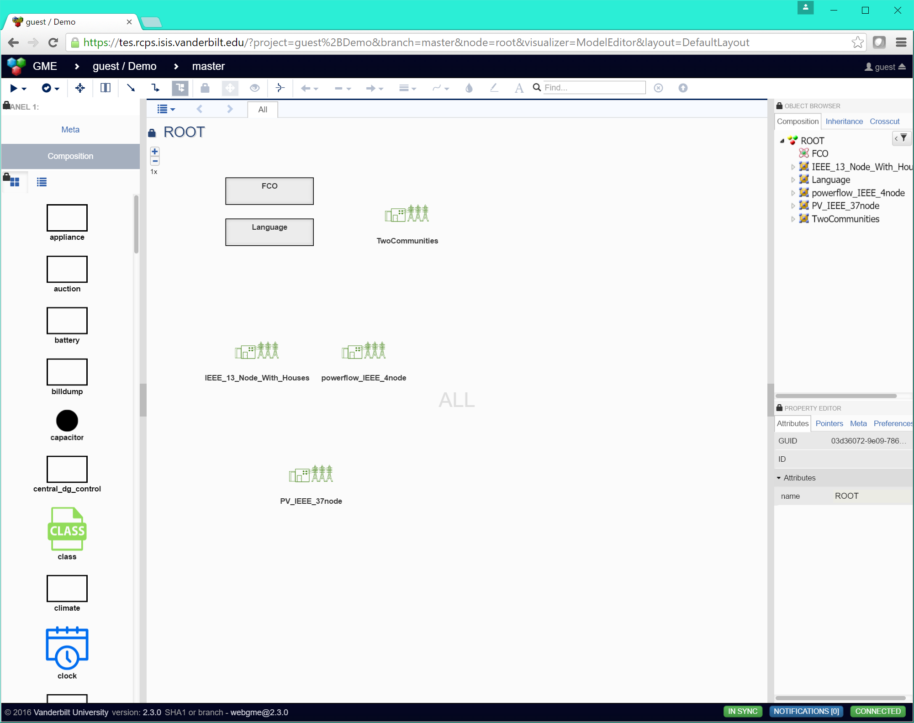
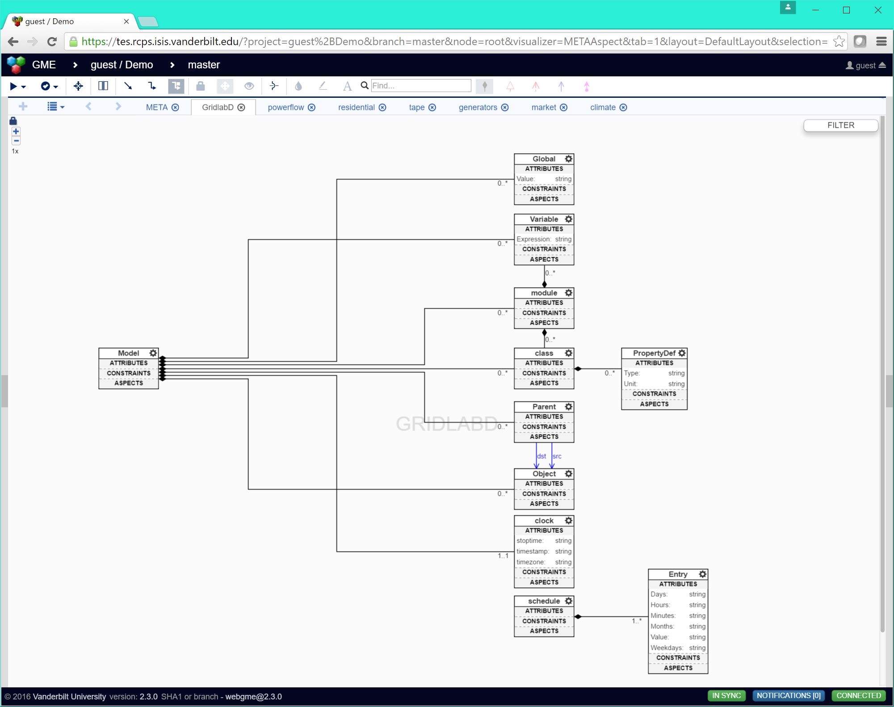
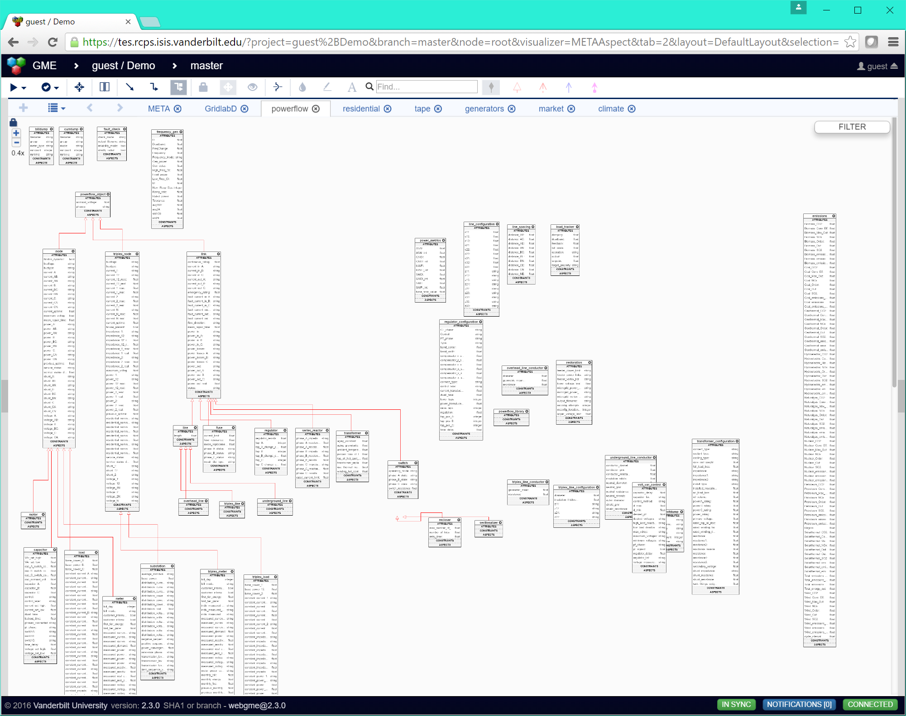
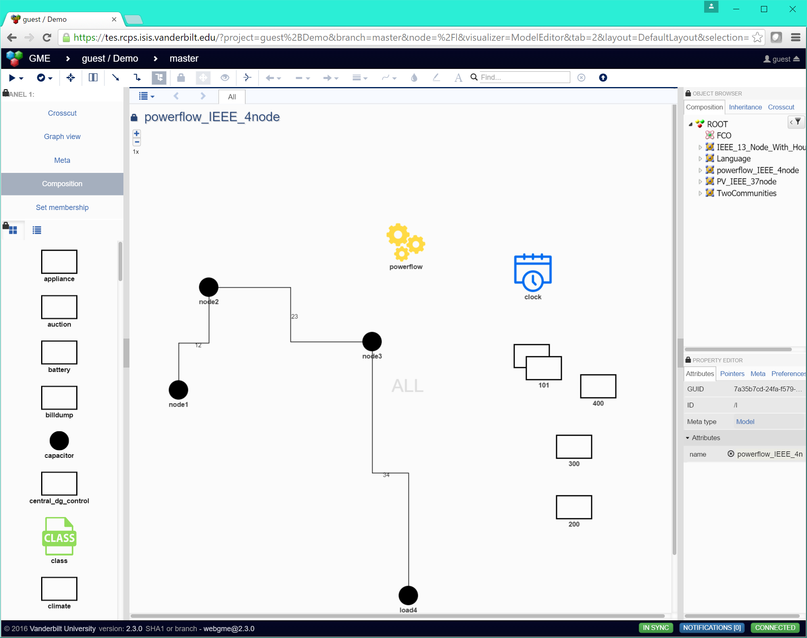
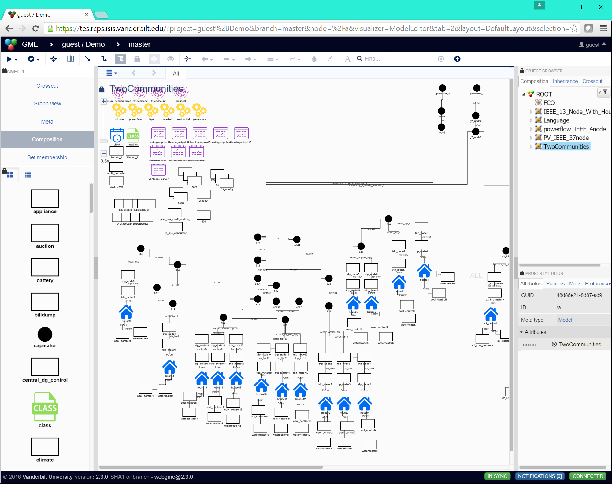
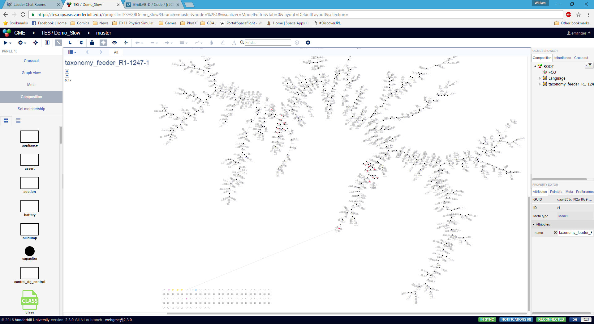

# webgme-gridlabd

Metamodel, visualization, and model generators for gridlab-d in
WebGME.

This document covers how to use the WebGME modeling environment for
creating, importing, updating, and rendering (serializing) Gridlab-D
models (GLM format).

**Note**: this document does not describe how Gridlab-D works, merely
how the WebGME interface works for importing, creating, and rendering
GLM files. Users who have questions about what a specific attribute of
a specific Gridlab-D object type means are referred to the
[Gridlab-D Wiki](http://gridlab-d.sourceforge.net/wiki/index.php/Main_Page).

**Table of Contents:**
- [WebGME Interface](#webgme-interface)
- [META](#meta)
- [Models](#models)
- [Plugins](#plugins)
  - [UpdateGLDMeta](#updategldmeta-plugin)
  - [ImportGLM](#importglm-plugin)
  - [GenerateGLM](#generateglm-plugin)
  - [SimulateWithGridlabD](#simulatewithgridlabd-plugin)
  - [SimulateTES](#simulatetes-plugin)
  - [SimulateTESCluster](#simulatetescluster-plugin)
- [Creating a Gridlab-D Model from Scratch](#creating-a-gridlab-d-model-from-scratch)

## WebGME interface

The webgme interface allows the visual creation and editing of models,
where the top level (ROOT) of the webgme interface can contain models,
and each model represents a GLM (gridlabd model).

**Note**: since the WebGME interface is designed to graphically model
  and represent `GLM` files, ancillary files which a single GLM file
  can include are not directly modeled. To capture those files as part
  of the webgme model, please create an `Include` object (with the
  name of the file as the name of the object) and upload the relevant
  file sa the new `Include` object's `file` attribute (by clicking on
  the attribute). Then when a user wants to access that file they can
  simply click on that attribute to download it from the server.



## META

The meta for webgme-gridlabd is broken up into many parts, with the
base meta (GridlabD) being the only hand-crafted part of the meta. The
base meta defines what a model is, what it can contain such as
objects, globals, variables, modules, classes, etc. The types defined
in this aspect are the most basic class definitions from which all
other gridlabd types derive (e.g. a node derives from a powerflow
object which derives from object).



The specific metas for each of the different gridlab-d modules are
defined in their own separate sheets, which are automatically created
when running the UpdateGLDMeta plugin (described below). An example of
an imported meta can be found below (note that when it is imported it
is not automatically laid out, so some manual layout of the objects
may be necessary to better visualize the meta).



## Models

Within a model, you have the ability to create nodes, links between
nodes (e.g. overhead lines, transformers), schedules, loads, etc. just
as you would in a gridlab-d model. Any connection objects between
nodes are visualized as lines connecting those nodes.

Below is a simple 4 node powerflow model which was automatically
imported from a gridlab-d model (GLM) file that exists in the gridlabd
repository.



Below is a more complex example showing two communities of houses
connected to two generators. Each house has water heaters, HVAC
systems, and controllers.



Finally, here is a very large (comparatively) model which was created 
and automatically laid out using the [ImportGLM](#importglm-plugin) 
plugin, from the [Taxonomy Feeder R1-12.47 model](https://sourceforge.net/p/gridlab-d/code/HEAD/tree/trunk/models/taxonomy_feeder_R1-12.47-1.glm) in the Gridlab-D source code repository.



## Plugins

This section describes the plugins available to the user for
interacting with the webgme client / server.

### UpdateGLDMeta Plugin

**Location**: `ROOT`

The UpdateGLDMeta plugin is useful for automatically updating or
extending the webgme gridlabd meta language with information about the
supported types from the current (or a selected) version of
gridlabd. The plugin takes as input a type specification file
([example](./gld_schema/powerflow.cpp)) which can be automatically
generated from gridlab-d in the following way:

``` bash
gridlabd --modhelp ${module_name} > ${module_name}.cpp
```

e.g.

``` bash
gridlabd --modhelp powerflow > powerflow.cpp
```

The information about gridlab-d's input arguments and how to run this
command can be found
[here](http://gridlab-d.sourceforge.net/wiki/index.php/Command_options)

When the UpdateGLDMeta plugin runs, it will check to see if the
objects already exist, and if they don't it will create new
meta-objects based on the file specification in a new `MetaAspect`
sheet with the same name as the file. Additionally, if it finds a
loaded svg (i.e. present in the `./src/svgs` folder with the same name
as the meta type it is trying to create, it will automatically assign
that svg to be the icon for that type of object. In this way it is
very easy to create a useful graphical modeling language for gridlab-d
with a minimal amount of effort.

### ImportGLM Plugin

**Location**: `ROOT`

From the root level, you can run the ImportGLM plugin which takes as
input an uploaded GLM file. The plugin parses this file and creates
webgme objects in accordance with the current webgme meta. This means
that any relevant meta types for that model should be present in the
meta.

The plugin supports auto-layout of the imported models. For the
auto-layout code, the plugin takes input parameters specifying the
number of iterations of the layout code, the length of the connections
and the size of the objects to be laid out. For the most part, these
parameters need not be changed from their default values. If the model
is too densely packed, then increase the size / length parameters, and
vice versa if the model is too sparsely packed. If the model is not
laid out well (many crossing connections for instance), then increase
the number of iterations.

### GenerateGLM Plugin

**Location**: `Model`

The GenerateGLM plugin performs the reverse transform of the ImportGLM
plugin, allowing the user to serialize their webgme gridlabd model out
into a simulatable GLM file.

### SimulateWithGridlabD Plugin

**Location**: `Model`

The SimulateWithGridlabD plugin provides the user the ability to
automatically test their gridlabd model. It executes that model in
GridlabD (which must be installed on the server) and provides the
stdout / stderr back to the user for inspection.

### SimulateTES Plugin

**Location**: `Model`

This plugin uses a a set of docker containers on the server to simuate
a Transactive Energy System (TES) using CPSWT as the backbone for
allowing distributed, coordinated simulation of reactive market
controllers, reactive demand controllers, communications network, and
power system.

**Note**: this plugin is designed to be run solely from the
  `TwoCommunities` model.

### SimulateTESCluster Plugin

**Location**: `Model`

This plugin uses a cluster of VMs to simuate a Transactive Energy
System (TES) using CPSWT as the backbone for allowing distributed,
coordinated simulation of reactive market controllers, reactive demand
controllers, communications network, and power system.

**Note**: this plugin is designed to be run solely from the
  `TwoCommunities` model.

## Creating a Gridlab-D Model from Scratch

If the user does not wish to import or modify an existing power system
model, they are free to create one from scratch by dragging a `Model`
object from the part browser into the `ROOT` level of the
project. Having done so, they can double-click to enter their new
model. Once inside the model, they are free to again drag and drop any
objects from the part browser into the active area of the model. Once
created, these objects may be selected (upon which point their
attributes will be displayed and editable within the attribute
pane). The editable attributes for an object are derived from the
`META` for that object, which was loaded as described in the
[UpdateGLDMeta section](#updategldmeta-plugin). A complete list of all
possible attributes for all possible types of objects is outside the
scope of this README, so users interested in which attributes have
which physical meaning are referred to the
[Gridlab-D Wiki](http://gridlab-d.sourceforge.net/wiki/index.php/Main_Page),
where they can find the reference documentation for specific object
types, e.g. for `powerflow` objects:
[Powerflow User Guide](http://gridlab-d.sourceforge.net/wiki/index.php/Power_Flow_User_Guide).

**Note**: Some capabilities of GLD currently only have limited
  support. The ability to define new object types on the fly within a
  GLM is not possible within the WebGME interface. However, the
  importer is able to parse, create, and serialize any such custom
  object types it finds. This feature may be supported in the future
  depending on users' needs and more discussion with GLD developers.
